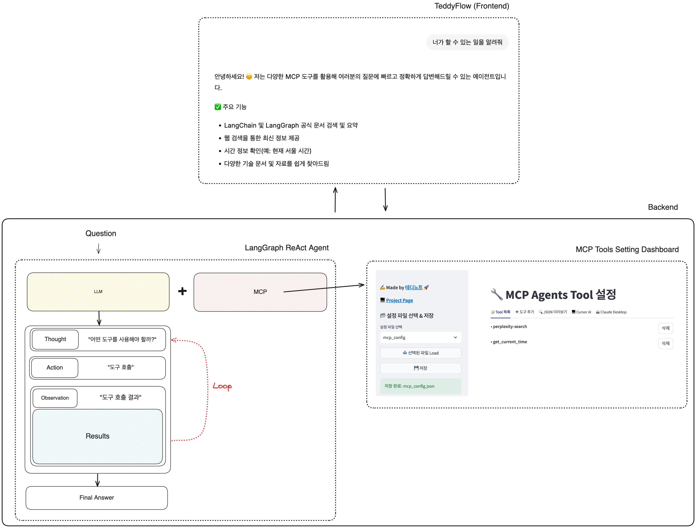
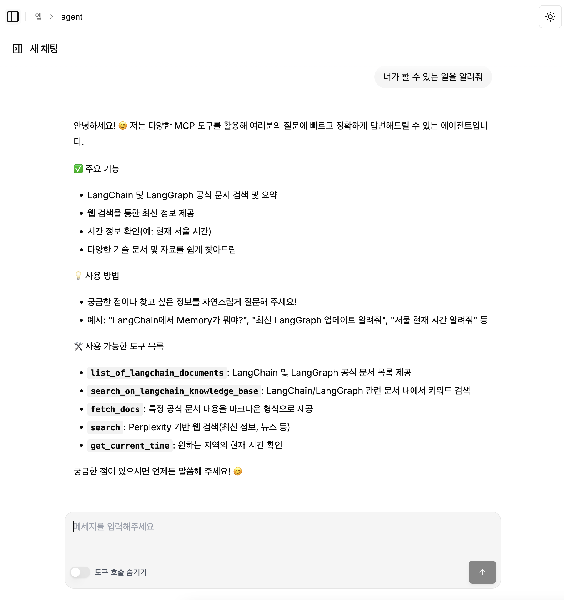
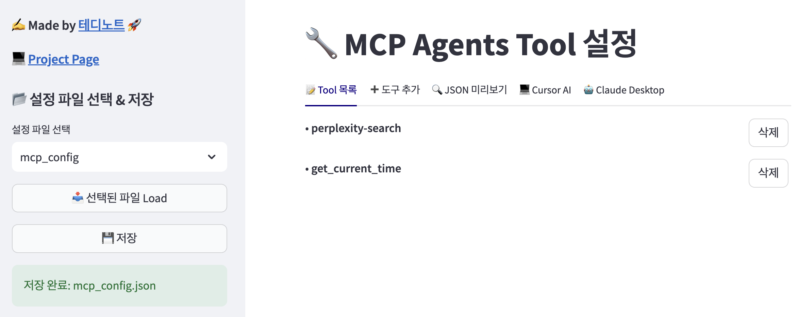
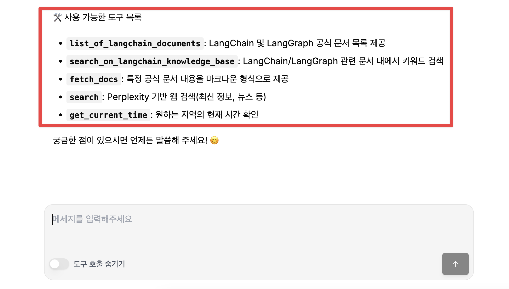
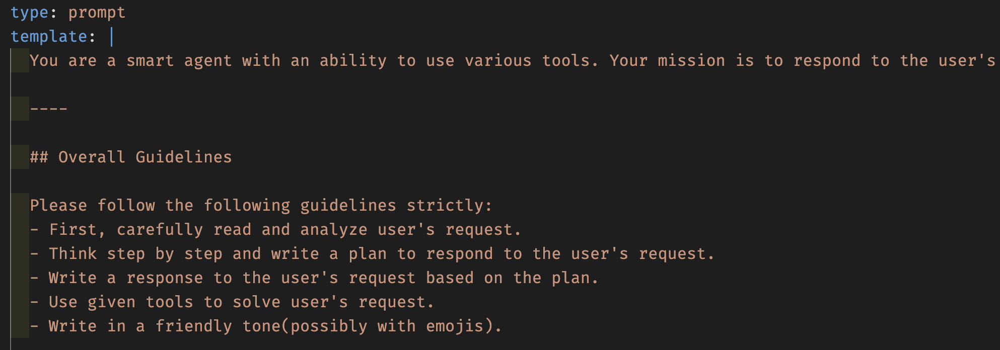
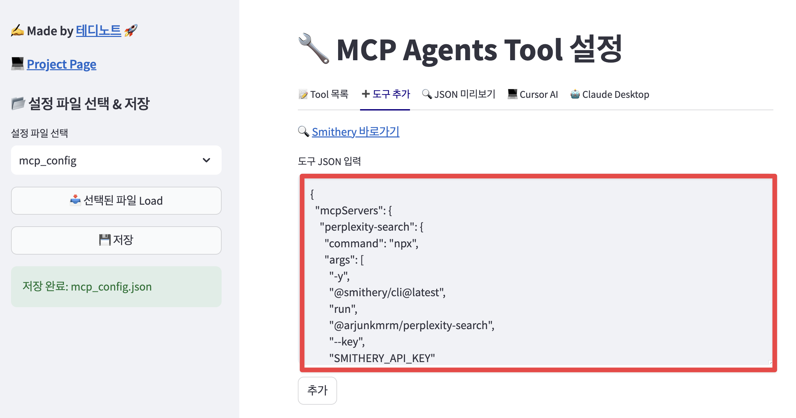

# LangGraph Dynamic MCP Agents


[![Open in - LangGraph Studio](https://img.shields.io/badge/Open_in-LangGraph_Studio-00324d.svg?logo=data:image/svg%2bxml;base64,PHN2ZyB4bWxucz0iaHR0cDovL3d3dy53My5vcmcvMjAwMC9zdmciIHdpZHRoPSI4NS4zMzMiIGhlaWdodD0iODUuMzMzIiB2ZXJzaW9uPSIxLjAiIHZpZXdCb3g9IjAgMCA2NCA2NCI+PHBhdGggZD0iTTEzIDcuOGMtNi4zIDMuMS03LjEgNi4zLTYuOCAyNS43LjQgMjQuNi4zIDI0LjUgMjUuOSAyNC41QzU3LjUgNTggNTggNTcuNSA1OCAzMi4zIDU4IDcuMyA1Ni43IDYgMzIgNmMtMTIuOCAwLTE2LjEuMy0xOSAxLjhtMzcuNiAxNi42YzIuOCAyLjggMy40IDQuMiAzLjQgNy42cy0uNiA0LjgtMy40IDcuNkw0Ny4yIDQzSDE2LjhsLTMuNC0zLjRjLTQuOC00LjgtNC44LTEwLjQgMC0xNS4ybDMuNC0zLjRoMzAuNHoiLz48cGF0aCBkPSJNMTguOSAyNS42Yy0xLjEgMS4zLTEgMS43LjQgMi41LjkuNiAxLjcgMS44IDEuNyAyLjcgMCAxIC43IDIuOCAxLjYgNC4xIDEuNCAxLjkgMS40IDIuNS4zIDMuMi0xIC42LS42LjkgMS40LjkgMS41IDAgMi43LS41IDIuNy0xIDAtLjYgMS4xLS44IDIuNi0uNGwyLjYuNy0xLjgtMi45Yy01LjktOS4zLTkuNC0xMi4zLTExLjUtOS44TTM5IDI2YzAgMS4xLS45IDIuNS0yIDMuMi0yLjQgMS41LTIuNiAzLjQtLjUgNC4yLjguMyAyIDEuNyAyLjUgMy4xLjYgMS41IDEuNCAyLjMgMiAyIDEuNS0uOSAxLjItMy41LS40LTMuNS0yLjEgMC0yLjgtMi44LS44LTMuMyAxLjYtLjQgMS42LS41IDAtLjYtMS4xLS4xLTEuNS0uNi0xLjItMS42LjctMS43IDMuMy0yLjEgMy41LS41LjEuNS4yIDEuNi4zIDIuMiAwIC43LjkgMS40IDEuOSAxLjYgMi4xLjQgMi4zLTIuMy4yLTMuMi0uOC0uMy0yLTEuNy0yLjUtMy4xLTEuMS0zLTMtMy4zLTMtLjUiLz48L3N2Zz4=)](https://langgraph-studio.vercel.app/templates/open?githubUrl=https://github.com/langchain-ai/react-agent)

## 프로젝트 개요

> 채팅 인터페이스



`LangGraph Dynamic MCP Agents` 은 Model Context Protocol(MCP)을 통해 다양한 외부 도구와 데이터 소스에 접근할 수 있는 ReAct 에이전트를 구현한 프로젝트입니다. 이 프로젝트는 LangGraph 의 ReAct 에이전트를 기반으로 하며, MCP 도구를 쉽게 추가하고 구성할 수 있는 인터페이스를 제공합니다.



### 주요 기능
 
**동적 방식으로 도구 설정 대시보드**

`http://localhost:2025` 에 접속하여 도구 설정 대시보드를 확인할 수 있습니다.



**도구 추가** 탭에서 [Smithery](https://smithery.io) 에서 사용할 MCP 도구의 JSON 구성을 복사 붙여넣기 하여 도구를 추가할 수 있습니다.


----

**실시간 반영**

도구 설정 대시보드에서 도구를 추가하거나 수정하면 실시간으로 반영됩니다.



**시스템 프롬프트 설정**

`prompts/system_prompt.yaml` 파일을 수정하여 시스템 프롬프트를 설정할 수 있습니다.

이 또한 동적으로 바로 반영되는 형태입니다.



만약, 에이전트에 설정되는 시스템프롬프트를 수정하고 싶다면 `prompts/system_prompt.yaml` 파일의 내용을 수정하면 됩니다.

----

### 주요 기능

* **LangGraph ReAct 에이전트**: LangGraph를 기반으로 하는 ReAct 에이전트
* **실시간 동적 도구 관리**: MCP 도구를 쉽게 추가, 제거, 구성 가능 (Smithery JSON 형식 지원)
* **실시간 동적 시스템 프롬프트 설정**: 시스템 프롬프트를 쉽게 수정 가능 (동적 반영)
* **대화 기록**: 에이전트와의 대화 내용 추적 및 관리
* **TeddyFlow 연동**: 채팅 인터페이스 연동
* **Docker 이미지 빌드**: Docker 이미지 빌드 가능
* **localhost 지원**: localhost 로 실행 가능(채팅 인터페이스 연동 가능)

## 설치 방법

1. 저장소 복제하기

```bash
git clone https://github.com/teddynote-lab/langgraph-dynamic-mcp-agents
cd langgraph-react-mcp-chat
```

2. uv를 사용하여 가상 환경 생성 및 의존성 설치

```bash
uv sync
```

3. `.env` 파일 설정하기

`.env.example` 파일을 `.env`로 복사하고 필요한 API 키를 추가합니다:

```bash
cp .env.example .env
```

`.env` 파일에서 `LLM_PROVIDER` 를 설정합니다.

선택 가능(택 1): `ANTHROPIC`, `OPENAI`, `AZURE_OPENAI`

```
LLM_PROVIDER=AZURE_OPENAI
```

아래는 필요한 API 키 목록입니다. (선택한 `LLM_PROVIDER` 에 따라 설정합니다)

`Anthropic`, `OpenAI`, `Azure OpenAI` 에서 사용할 API 키를 설정합니다.(반드시 하나의 모델은 설정되어야 합니다.)

- `ANTHROPIC_API_KEY`: Anthropic API 키
- `OPENAI_API_KEY`: OpenAI API 키
- `AZURE_OPENAI_API_KEY`: Azure OpenAI API 키
- `AZURE_OPENAI_ENDPOINT`: Azure OpenAI 엔드포인트


4. MCP 도구 설정

`mcp-config` 폴더에 있는 `mcp_config.json` 파일을 기준으로 모델이 사용할 MCP 도구를 설정합니다.

따라서, 미리 사용하고자 하는 MCP 도구를 JSON 형식으로 설정해 둘 수 있습니다.
이 과정은 도구 설정 대시보드에서도 설정이 가능합니다.

아래는 샘플로 작성된 예시입니다.

```json
{
  "mcpServers": {
    "perplexity-search": {
      "command": "npx",
      "args": [
        "-y",
        "@smithery/cli@latest",
        "run",
        "@arjunkmrm/perplexity-search",
        "--key",
        "SMITHERY_API_KEY 를 입력하세요"
      ],
      "transport": "stdio"
    },
    "get_current_time": {
      "command": "python",
      "args": [
        "/app/resources/mcp_server_time.py"
      ],
      "transport": "stdio"
    }
  }
}
```

5. .py 파일을 MCP `stdio` 서버로 추가

- (참고) `resources` 폴더에 있는 `mcp_server_time.py` 파일을 참고하시기 바랍니다.

1. 사용하고자 하는 커스텀 작성된 .py 파일을 `resources` 폴더에 추가합니다. 그리고 `stdio` 서버로 실행할 수 있도록 코드를 작성합니다.

2. `mcp-config/mcp_config.json` 에 추가할 때 파일 경로를 수정합니다.

    **규칙**

    `./resources/파일명.py` > `/app/resources/파일명.py`

    예를 들어, `./resources/mcp_server_time.py` 파일을 추가하고자 한다면 `/app/resources/mcp_server_time.py` 로 설정합니다.

    ```json
    "get_current_time": {
        "command": "python",
        "args": [
        "/app/resources/mcp_server_time.py"
        ],
        "transport": "stdio"
    }
    ```

6. Smithery 에 등록된 도구 추가

[Smithery](https://smithery.ai/) 에서 사용할 MCP 도구의 JSON 구성을 가져와 도구 대시보드에서 쉽게 추가할 수 있습니다.

1. [Smithery](https://smithery.io) 웹사이트를 방문하여 사용하고 싶은 도구를 선택합니다.
2. 도구 페이지에서 오른쪽의 'COPY' 버튼을 클릭하여 JSON 구성을 복사합니다.


3. `mcp_config.json` 파일을 열고 복사한 JSON을 추가합니다.

> 복사한 내용을 붙여넣기 합니다.



## 애플리케이션 실행

모든 설정이 완료되었다면, 다음 명령어로 실행할 수 있습니다.

```bash
docker-compose build --no-cache && docker-compose up -d
```

**접속 주소**

- TeddyFlow 연동: https://teddyflow.com/
- 채팅 인터페이스: `http://localhost:2025`
- 도구 설정 대시보드: `http://localhost:2024`

## teddyflow.com 연결 방법


1. 먼저, 터미널에서 `langgraph dev` 명령어를 실행하여 개발 서버를 시작합니다.
2. teddyflow.com 에서 회원가입을 합니다.

회원가입시 "베타 키" 에 `teddynote-youtube` 를 입력하면 승인 없이 바로 가입이 가능합니다.


3. 로그인 후 "새로운 앱 연결" 버튼을 클릭합니다.


4. 앱 이름을 입력하고 "연결" 버튼을 클릭합니다.
5. 탭에서 "LangGraph" 를 선택한 뒤 다음의 정보를 입력합니다.
- Endpoint: `http://localhost:2024`
- Graph: `agent`


6. 연결 설정이 완료되면 "저장" 버튼을 클릭합니다.

7. "앱 연결하기" 버튼을 눌러 저장합니다.

## 회사명 / 커뮤니티 로고 및 브랜딩 적용

회사명 / 커뮤니티를 위한 커스텀 기능을 출시하였습니다.


도입을 희망하신다면 service@brain-crew.com 으로 문의주시면 도움을 드리겠습니다.


## 라이센스

Apache License 2.0 ([LICENSE](LICENSE))